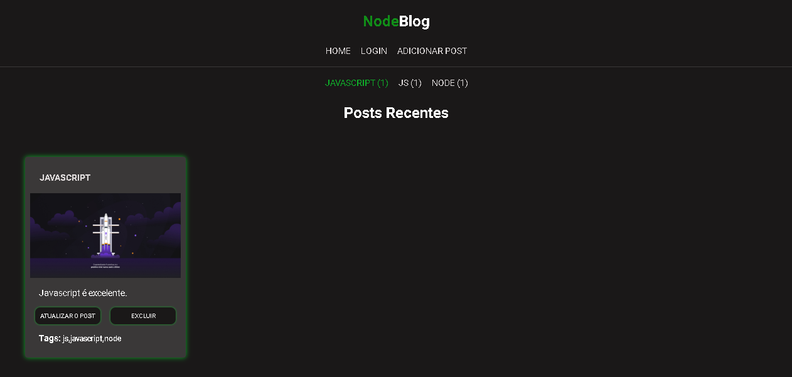

# Projeto: Proffy

 

# Descrição

Blog Node é um projeto pessoal, com um sistema de CRUD nas postagens, filtros de buscas por tags e upload de imagens. O projeto está em atualização constante. A próxima etapa será um sistema de login de usuários.

# Tecnologias Utilizadas

Front-end

1. HTML/CSS
2. Mustache

Backend

1. Nodejs
2. MongoDB

# Executando o projeto

1 - npm init

2 - npm install para baixar todas as dependências.

3 - npm install express.

4 - npm run dev Para fazer o servidor funcionar.

5 - servidor na porta: localhost:7775

# Dependências

1 - npm install express

2 - npm install multer jimp uuid

3 - npm install mongoose

4 - npm install dotenv

5- npm install express-session cookie-parser express-flash

6 - npm install slug

# Licença

:book: Licença MIT. 